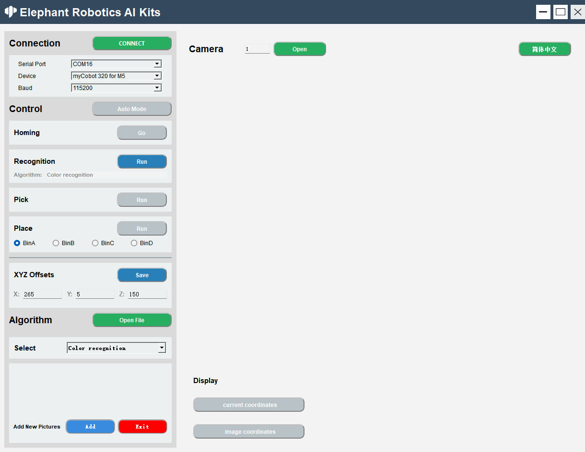
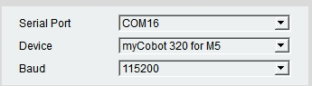
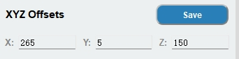

# **AiKit UI**

- **适用机型设备:** 
  - myPalletizer 260 for M5
  - myCobot 280 for M5
  - ultraArm P340
  - mechArm 270 for M5
  - myCobot 280 for Pi
  - mechArm 270 for Pi
  - myCobot 280 for JN
  - myPalletizer 260 for Pi
  - myCobot 280 RISCV

## 软件环境

Raspberry Pi Ubuntu20.04 system、Windows 10 or Windows 11、Jetson Nano Ubuntu20.04 system

## 安装Python依赖包

### 1. 普通机型设备
   - myPalletizer 260 for M5
   - myCobot 280 for M5
   - ultraArm P340
   - mechArm 270 for M5
   - myCobot 280 for Pi
   - mechArm 270 for Pi
   - myCobot 280 for JN
   - myPalletizer 260 for Pi


使用前需确保系统已经安装以下第三方库，其中 `opencv-python`和 `opencv-contrib-python`必须指定安装 **4.6.0.66** 的版本，其他库原则上无需指定版本号。

```bash
opencv-python==4.6.0.66
opencv-contrib-python==4.6.0.66
pymycobot==3.9.9
PyQt5==5.15.10
```

如若未安装，请参考下面命令进行安装：

```angular2html
pip install pymycobot
pip install opencv-python==4.6.0.66
pip install opencv-contrib-python==4.6.0.66
pip install pyqt5

```

#### 安装代码

```angular2html
git clone https://github.com/elephantrobotics/AiKit_UI.git
```

### 2. RISCV机型
   - myCobot 280 RISCV

#### 创建虚拟环境

```bash
sudo apt install python3-virtualenv
virtualenv elephantics-venv
source elephantics-venv/bin/activate
```

#### 安装依赖项

```bash
sudo apt install libopenblas-dev
```

#### 安装代码

```bash
git clone https://github.com/elephantrobotics/AiKit_UI.git
```

#### 安装python依赖库

```bash
cd AiKit_UI/libraries/yolov8File
pip install -r requirements.txt
```


## 启动程序

终端进入主程序目录中运行

```python
cd AiKit_UI
python main.py
```

>> **注意**： myCobot 280 RISCV机型的YOLO算法识别改用为YOLOv8，不再使用YOLOv5识别算法，当机型设备为RISCV时，算法下拉框列表只能选中yolov8,不可选中yolov5,yolov8的使用更加简单便捷，无需手动框选识别区域，可自动框选，使用方式与颜色识别一样。

启动成功之后如下图所示:<br>

 

### **功能介绍**

#### **语言切换**

点击窗口右上角的按钮可以进行语言（中文、英文）之间的切换.<br>


#### **设备连接**

1. 选择串口、设备、波特率<br>
2. 点击'连接'按钮进行连接，连接成功之后’连接‘按钮会变成'断开'<br>
   

3. 点击’断开‘按钮会断开与机械臂的连接<br>
   

4. 成功连接机械臂之后，灰色按钮将会被点亮，变为可点击状态。<br>
   

#### **打开相机**

1. 设置相机序号，默认的序号为0，Windows使用时，通常序号为1，Linux使用时，序号通常为0；RISCV机型相机序号默认为20.<br>
   

2. 点击‘打开’按钮则可以尝试打开相机，若是打开失败，则应该尝试更改相机序号；相机成功打开如下图所示： 注意：使用之前应该调整摄像头刚好在二维码白板的正上方，且呈一条直线正对机械臂。<br>
   

3. 成功打开摄像头之后，点击'关闭'按钮关闭摄像头<br>
   

#### **算法控制**

1. 全自动模式，点击'全自动'按钮之后，识别、抓取、放置将一直处于打开状态；再次点击'全自动'按钮关闭全自动模式。<br>
   

2. 回到抓取初始点位，点击’运行‘按钮，会停止当前正进行的操作，回到初始点位。<br>

3. 逐步操作模式 识别：点击’运行‘按钮开始识别，算法是当前使用的算法。<br>
   

   抓取：点击’运行‘按钮开始抓取，抓取成功之后，自动关闭识别和抓取，下次使用需要再次点击。 <br>

   
   
   放置：点击’运行‘按钮开始放置，BinA，BinB，BinC，BinD选择框分别对应BinA，BinB，BinC，BinD4个存储盒，选择后会放置到指定的存储盒。<br>

   

4. 抓取点位调节，X 偏移量、Y 偏移量、Z 偏移量分别代表的是机械臂坐标X轴、Y轴、Z轴的位置，可以根据实际需求进行修改，点击’保存‘按钮进行保存，保存成功后将会按照最新点位进行抓取。<br>
   <br>
   

5. 打开文件位置，我们的代码是开源的，你可以根据自己的需求进行修改，点击’打开 File‘按钮会打开文件所在位置。<br>
    
   Open the 'main.py' file and modify it <br>
   
   注意：其中’main.py.bak‘文件是’main.py‘文件的备份，需要使用时删除’main.py‘文件，重新修改’main.py.bak‘文件的后缀名为’main.py‘即可；然后重新备份’main.py‘文件，命名为’main.py.bak'即可；你也可以选择重新下载项目。
   
6. 算法选择，分别有颜色识别，形状识别，二维码识别，特征点识别 yolov5或yolov8，选择对应的算法将进行对应的识别。<br>

   >> 注意：RISCV机型取消了yolov5识别算法（仅限于RISCV机型），改用yolov8识别算法；改用后的yolov8算法，在识别前无需手动框选aruco板子识别区域，可以自动框选进行识别，使用方式与颜色识别一样

   

7. **如何 yolov5.**
   成功连接机械臂后，算法选择‘yolov5’<br>
   <br>
   然后打开相机<br>
   <br>
   放入需要识别的图片，然后点击剪切按钮<br><br>
   截取二维码白板部分，按回车确认（可重复截取）<br><br>
   然后识别并抓取。<br>
   
8. 为‘特征点识别‘添加图片 <br>
   

   点击’添加'按钮，则会打开相机以及出现提示。<br>

   

   点击‘剪切’按钮，则会截取当前相机内容，并给出提示‘框出需要保存的内容后按下ENTER键’<br>

   

   需要保存的内容后按下ENTER键，开始选择保存的区域，分别对应BinA，BinB，BinC，BinD4个存储盒。<br>

   

   此处会显示截取的内容<br>
   

   可进入以下路径查看保存的图片<br>
   

9.  点击‘退出'按钮退出图片添加，注意：若是开始截取，请截取完之后再退出，可选择不保存截取的图片。<br>
   

#### **坐标显示**

1. 机械臂实时坐标显示：点击’实时坐标'按钮开启<br>

2. 识别坐标显示：点击''定位坐标'按钮开启<br>
   

 
